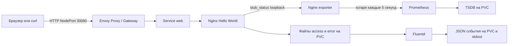

# DevOps стенд на Ubuntu 24.04 и kubeadm

Одноузловой Kubernetes публикует Nginx через Gateway API. Prometheus собирает реальные метрики Nginx exporter, Fluentd читает access/error-логи и сохраняет обработанные события на постоянном томе. Решение предназначено для воспроизводимой демонстрации на выделенной Ubuntu 24.04 x86_64.

**Статус проверки: PASS, 2 октября 2026.** На Ubuntu 24.04.5 подтверждены установка из чистого снимка через публичный `git clone` и команды README, HTTP через Gateway, метрики Prometheus, оба потока Fluentd, сохранность после пересоздания Pod, повторный bootstrap/deploy и автоматическое восстановление после перезагрузки VM. Логи и историческая метрика сохранились также после перезагрузки. Результаты и проверенная ревизия приведены в [VERIFICATION.md](VERIFICATION.md).

## Архитектура



Envoy Gateway управляет Envoy Proxy по ресурсам GatewayClass, Gateway, HTTPRoute и EnvoyProxy. Внешний NodePort есть только у Envoy; приложение и Prometheus используют ClusterIP. Один Pod приложения содержит Nginx, exporter и Fluentd. Одноузловой kubeadm использует containerd и Flannel.

## Версии и зависимости

| Компонент | Версия |
|---|---|
| Ubuntu Server | 24.04 LTS, x86_64 |
| Kubernetes / kubeadm / kubelet / kubectl | 1.35.9, apt `1.35.9-1.1` |
| containerd | apt `2.2.1-0ubuntu1~24.04.3` |
| Flannel | 0.28.9 |
| Helm | 3.21.2 |
| Envoy Gateway | 1.8.5 |
| Gateway API, standard channel | 1.5.1 |
| Nginx | 1.30.5-alpine |
| Nginx exporter | 1.5.1 |
| Prometheus | 3.15.0 |
| Fluentd | 1.19.3-debian-2.4 |

`versions.env` фиксирует версии и digest образов. Helm charts и Flannel manifest сохранены в `vendor/`; `vendor/SHA256SUMS` проверяется перед развертыванием. Bootstrap сверяет SHA256 Linux-бинарника Helm. Envoy data-plane image определяется сохраненным chart и контроллером соответствующей версии, без ручной замены его minor-версии. Фактические версии пакетов записываются в `.state/installed-packages.txt`.

Официальные источники: [kubeadm](https://kubernetes.io/docs/setup/production-environment/tools/kubeadm/install-kubeadm/), [совместимость Envoy Gateway](https://gateway.envoyproxy.io/news/releases/matrix/), [CRDs и установка Envoy Gateway](https://gateway.envoyproxy.io/v1.8/install/install-helm/), [Nginx exporter](https://github.com/nginx/nginx-prometheus-exporter), [Fluentd tail](https://docs.fluentd.org/input/tail).

## Требования к среде

- Выделенная чистая Ubuntu 24.04 x86_64 с sudo, systemd, минимум 4 CPU, 8 ГБ RAM и 15 ГБ свободного диска; рекомендуется диск 50 ГБ.
- Постоянный IPv4-адрес узла. Сети `10.244.0.0/16` и `10.96.0.0/12` должны быть свободны от пересечения с существующими маршрутами.
- Интернет для Ubuntu apt, pkgs.k8s.io, get.helm.sh, registry.k8s.io, Docker Hub и registry образов Flannel; рабочий NTP и активный systemd-timesyncd. Bootstrap включает systemd-time-wait-sync и зависимость containerd/kubelet от синхронизации часов. При недоступном NTP запуск этих служб ожидает синхронизации. Коммерческие облачные сервисы, домен и публичный IP не требуются.
- Один узел; выполнение bootstrap на машине с действующими чужими сервисами не поддерживается.
- При включенном firewall разрешите SSH из доверенной сети и HTTP NodePort 30080 для проверяющего клиента, а также необходимый внутрикластерный трафик. API 6443, kubelet 10250 и метрики не публикуйте в Интернет. Скрипты не отключают firewall.

VMware служит только способом получить Ubuntu: проверяющий может использовать другую VM или физический сервер с теми же требованиями. Для конкретного локального стенда применяется существующий Custom NAT VMnet0 и отдельная Host-only VMnet2. Глобальные настройки существующей сети не сбрасываются.

| Интерфейс локальной Ubuntu | Адрес | Назначение |
|---|---|---|
| nat0 / Custom VMnet0 | 10.10.10.250/24, gateway 10.10.10.1 | Интернет через существующий NAT |
| lab0 / Host-only VMnet2 | 192.168.222.10/24, без gateway | SSH, Kubernetes и HTTP из Windows |
| Windows VMnet2 | 192.168.222.1/24 | Подключение хоста к Ubuntu |

Эти адреса относятся к локальному стенду; на другом сервере используйте его собственный стабильный адрес. Перед назначением убедитесь, что адрес свободен, включая адреса выключенных виртуальных машин.

## Развертывание

В чистой Ubuntu установите Git, если его нет, и клонируйте репозиторий:

```bash
sudo apt-get update
sudo apt-get install -y git
git clone https://github.com/pnmk1/mtc-devops-kubeadm.git
cd mtc-devops-kubeadm
sudo NODE_IP=192.168.222.10 bash bootstrap.sh
bash deploy.sh
```

На другой Ubuntu задайте ее адрес в `NODE_IP`. Bootstrap проверяет ОС, ресурсы, маршруты, устанавливает закрепленные зависимости, выключает swap, согласует systemd cgroups, создает кластер и Flannel, разрешает workloads на control-plane и готовит локальное хранение. Права kubeconfig ограничены владельцем.

`deploy.sh` устанавливает standard Gateway API и Envoy CRDs отдельно от контроллера, затем namespace, local PV/PVC, ConfigMaps, Deployments, Services и Gateway-ресурсы. Обновление конфигурации меняет аннотацию Pod и инициирует rollout. Все ожидания имеют таймауты. При ошибке выводятся Kubernetes events и последние логи.

Повторный запуск:

```bash
sudo NODE_IP=192.168.222.10 bash bootstrap.sh
bash deploy.sh
```

Bootstrap сохраняет исправный кластер, который ранее создал этот репозиторий. Чужой кластер, несовместимая версия, изменившийся IP и частично созданный кластер вызывают ошибку с объяснением. Автоматического reset, upgrade и удаления данных нет.

## Проверка приложения и Gateway API

Из Windows PowerShell:

```powershell
curl.exe -fsS -H "Host: demo.local" http://192.168.222.10:30080/
```

Ожидается `Hello World!` и HTTP 200. DNS-запись для `demo.local` не нужна, потому что hostname передан заголовком.

Из Ubuntu:

```bash
kubectl -n mtc-demo get gateway,httproute
kubectl -n mtc-demo describe gateway demo
kubectl -n mtc-demo describe httproute web
bash verify.sh
```

Gateway должен иметь `Accepted=True`, `Programmed=True`; HTTPRoute — текущие `Accepted=True`, `ResolvedRefs=True`. Запрос с `Host: wrong.invalid` возвращает 404. Внешний запрос идет через NodePort Envoy, а не через Service приложения или его port-forward.

## Проверка мониторинга

В Ubuntu откройте отдельное SSH-подключение и выполните:

```bash
kubectl -n mtc-demo port-forward --address=127.0.0.1 service/prometheus 9090:9090
```

В Windows откройте SSH-туннель `ssh -L 9090:127.0.0.1:9090 ubuntu@192.168.222.10` с ключом вашего стенда. В браузере откройте `http://127.0.0.1:9090`; на `/targets` target `nginx` должен быть UP.

Запросы PromQL:

```promql
up{job="nginx"}
nginx_up{job="nginx"}
nginx_http_requests_total{job="nginx"}
nginx_connections_active{job="nginx"}
rate(nginx_http_requests_total{job="nginx"}[1m])
```

Первые два запроса возвращают 1. Счетчик запросов положительный и включает служебные обращения exporter/probes; его нельзя трактовать как число только пользовательских запросов. Метрики снимаются каждые 5 секунд. Prometheus хранит TSDB на PVC, retention 24 часа и 2 GB.

## Проверка логирования

Nginx пишет JSON access-лог и текстовый error-лог в `/var/log/demo/raw`. Fluentd использует отдельные постоянные position files, читает существующие и новые записи, передает обработанные события в stdout и `/var/log/demo/collected`. `source` различает `demo.access` и `demo.error`. File buffer постоянный, ограничен 64 MB и сбрасывается каждые 2 секунды.

```bash
MARKER="manual-$(date +%s)"
curl -fsS -H 'Host: demo.local' "http://192.168.222.10:30080/?check=$MARKER"
curl -s -o /dev/null -H 'Host: demo.local' "http://192.168.222.10:30080/missing-$MARKER"
kubectl -n mtc-demo logs deployment/web -c fluentd --since=5m
kubectl -n mtc-demo exec deployment/web -c fluentd -- sh -c 'ls -lh /var/log/demo/collected; cat /var/log/demo/collected/*.log'
```

Уникальный маркер должен появиться в обработанной access-записи; запрос `/missing-...` создает также error-запись. Для автоматической проверки обоих потоков и сохраненных файлов используйте `verify.sh`: он ожидает flush с ограниченным таймаутом.

## Сохранность, повторяемость и доказательства

```bash
bash scripts/check-persistence.sh
sudo NODE_IP=192.168.222.10 bash bootstrap.sh
bash deploy.sh
sudo reboot
# После восстановления SSH:
bash verify.sh
```

`check-persistence.sh` пересоздает Pod приложения и Prometheus, проверяет старую собранную запись и историческую метрику в тот же момент времени, затем заново проверяет весь стенд. Он временно прерывает сервисы именно этого демонстрационного namespace.

`verify.sh` сохраняет результат, маркер, HTTP-ответ, условия маршрута, target/метрики Prometheus и собранные Fluentd события в `artifacts/<UTC timestamp>`. `PASS` появляется только после всех его проверок. Эти артефакты локальны и по умолчанию исключены из Git; перед публикацией удалите частные IP и другие локальные данные. Скрипт проверки не публикует отчет самостоятельно.

Для проверки с нуля сначала выгрузите нужные локальные доказательства. Восстановите **снимок только новой Ubuntu VM**, сделанный после установки ОС и до bootstrap, затем выполните команды README из свежего клона. Снимки Windows-VM и Restore Defaults для сетей VMware не нужны.

## Проверки конфигураций

```bash
python3 -m venv .cache/check-venv
.cache/check-venv/bin/pip install -r requirements-check.txt
.cache/check-venv/bin/python scripts/static-check.py
```

Для создания venv на Ubuntu может потребоваться `sudo apt-get install -y python3-venv`. Проверка рендерит закрепленные Helm charts, проверяет Gateway/Envoy ресурсы по их CRD schemas, наличие digest образов, привязки томов и выбранные ограничения Pod. Она не заменяет `verify.sh` на работающей Ubuntu.

## Безопасность и ограничения

- Nginx, exporter, Fluentd и Prometheus работают без root, с запретом privilege escalation, сброшенными capabilities, seccomp RuntimeDefault и read-only root filesystem. Записываемые каталоги вынесены в тома; namespace приложения использует restricted Pod Security.
- Workloads не получают ServiceAccount token. Контроллер использует права, необходимые его закрепленному chart. Flannel требует привилегий на узле согласно upstream manifest.
- Kubeconfig, SSH-ключи, пароли и токены не входят в репозиторий. `.state/` и `artifacts/` исключены из Git. Не публикуйте данные доступа при диагностике.
- Один узел не обеспечивает высокую доступность. Recreate означает короткий перерыв при обновлении. Local PV привязан к этому узлу и не заменяет резервную копию.
- Значения capacity local PV не являются файловой квотой. Raw/collected логи в этой демонстрации не удаляются автоматически: следите за свободным диском. Для длительной эксплуатации нужны ротация исходных файлов и политика удаления/архивирования обработанных событий.
- Внешний протокол HTTP; TLS, Grafana, полнотекстовый поиск логов и production-автоматизация восстановления не заявлены.

## Диагностика

```bash
kubectl get nodes -o wide
kubectl get pods -A -o wide
kubectl -n mtc-demo get pvc
kubectl -n mtc-demo get events --sort-by=.lastTimestamp
kubectl -n mtc-demo logs deployment/web -c nginx --tail=50
kubectl -n mtc-demo logs deployment/web -c fluentd --tail=50
kubectl -n envoy-gateway-system logs deployment/envoy-gateway --tail=50
sudo journalctl -u kubelet -u containerd -n 100 --no-pager
```

`Pending` PVC/Pod: проверьте метку узла `mtc-devops.storage=local`, существование каталогов `/var/lib/mtc-devops` и права UID 1000. `ImagePullBackOff`: проверьте DNS/Интернет из Ubuntu и доступность registry. HTTP 404 при правильном приложении: проверьте `Host: demo.local` и условия HTTPRoute. Target DOWN: проверьте exporter и внутренний Service `web-metrics`. Нет собранных логов: проверьте Fluentd, position files и права тома. Ошибка порта 19090: остановите прежний локальный port-forward перед `verify.sh`.

## Оформление сдачи

Публичный репозиторий должен находиться в `main` и клонироваться без авторизации. Финальный паспорт содержит только подтвержденные результаты и не более 4 страниц. Архив `Торопов.zip` содержит `Ссылка.txt` (только URL репозитория) и `Паспорт.pdf`; объем архива до 18 MB, паспорта до 15 MB. Прием до 4 октября 23:59; часовой пояс в задании не указан. После дедлайна изменения репозитория запрещены.

