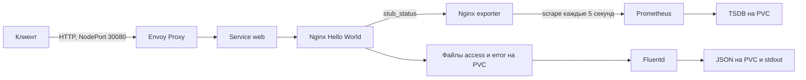

# DevOps стенд: Ubuntu, kubeadm и Gateway API

Одноузловой Kubernetes на Ubuntu 24.04 публикует Nginx через Envoy Gateway. Prometheus собирает метрики Nginx exporter, Fluentd читает access/error-логи и сохраняет обработанные события. Развертывание выполняется Bash-скриптами на собственном узле проверяющего.

## Архитектура



Envoy Gateway управляет Envoy Proxy по ресурсам GatewayClass, Gateway, HTTPRoute и EnvoyProxy. NodePort задается декларативно в EnvoyProxy. Приложение и Prometheus доступны внутри кластера через ClusterIP. Один Pod приложения содержит Nginx, exporter и Fluentd; Prometheus запущен отдельным Deployment.

## Версии

| Компонент | Версия |
|---|---|
| Ubuntu Server | 24.04 LTS, x86_64 |
| Kubernetes / kubeadm / kubelet / kubectl | 1.35.9, apt `1.35.9-1.1` |
| containerd | apt `2.2.1-0ubuntu1~24.04.3` |
| Flannel | 0.28.9 |
| Helm | 3.21.2 |
| Envoy Gateway | 1.8.5 |
| Gateway API, standard channel | 1.5.1 |
| Nginx | 1.30.5-alpine |
| Nginx exporter | 1.5.1 |
| Prometheus | 3.15.0 |
| Fluentd | 1.19.3-debian-2.4 |

Версии и digest образов закреплены в `versions.env`. Helm charts и Flannel manifest находятся в `vendor/`; перед установкой проверяется `vendor/SHA256SUMS`. Bootstrap также проверяет SHA256 бинарника Helm. Образ Envoy Proxy выбирается закрепленным chart и контроллером. Фактические версии установленных пакетов записываются локально в `.state/installed-packages.txt`.

## Среда развертывания

- Выделенная Ubuntu 24.04 x86_64 с systemd и sudo: минимум 4 CPU, 8 ГБ RAM и 15 ГБ свободного диска; рекомендуется диск 50 ГБ.
- Стабильный IPv4-адрес узла, доступный проверяющему клиенту. Сети Pod `10.244.0.0/16` и Service `10.96.0.0/12` не должны пересекаться с существующими маршрутами.
- Интернет для apt, pkgs.k8s.io, get.helm.sh и контейнерных registry; активный `systemd-timesyncd` и доступный NTP.
- При включенном firewall нужно разрешить SSH, HTTP на 30080 и необходимый внутрикластерный трафик. Скрипты не отключают firewall. Kubernetes API и служебные endpoints не требуется открывать в Интернет.

Подойдет VM или физический сервер. Доступ к исходному стенду, платный облачный сервис, домен и публичный IP не нужны. Bootstrap рассчитан на отдельный узел; установка поверх чужого кластера не поддерживается.

## Развертывание

На чистой Ubuntu:

```bash
sudo apt-get update
sudo apt-get install -y git
git clone https://github.com/pnmk1/mtc-devops-kubeadm.git
cd mtc-devops-kubeadm
sudo bash bootstrap.sh
bash deploy.sh
```

По умолчанию bootstrap выбирает адрес интерфейса с маршрутом в Интернет. Если у узла несколько интерфейсов, перед первым запуском выберите стабильный адрес, доступный клиенту, и передайте его явно:

```bash
sudo NODE_IP=<IPv4-адрес-узла> bash bootstrap.sh
```

Замените `<IPv4-адрес-узла>` своим адресом без угловых скобок. Адрес должен уже быть назначен интерфейсу Ubuntu; bootstrap не настраивает сеть ОС.

`bootstrap.sh` устанавливает containerd и kubeadm, выключает swap, настраивает systemd cgroups, создает кластер и Flannel, разрешает workloads на control-plane и готовит каталоги local PV. Перед запуском containerd/kubelet он обеспечивает ожидание синхронизации часов через `systemd-time-wait-sync`.

`deploy.sh` устанавливает CRDs Gateway API и Envoy, контроллер, ресурсы приложения, Prometheus и хранение, затем запускает `verify.sh`. Ожидания в скриптах ограничены таймаутами; при ошибке выводятся события и логи. Изменение конфигурации вызывает rollout приложения.

Для повторного запуска используйте те же `sudo bash bootstrap.sh` и `bash deploy.sh`. Bootstrap сохраняет ранее созданный исправный кластер и его IP. Чужой кластер, несовместимая версия, другой IP или частичная установка вызывают диагностическую ошибку; автоматического reset и удаления данных нет.

## Проверка приложения и Gateway API

В Ubuntu из каталога репозитория:

```bash
NODE_IP=$(kubectl get nodes -l mtc-devops.storage=local -o jsonpath='{.items[0].status.addresses[?(@.type=="InternalIP")].address}')
curl -fsS -H 'Host: demo.local' "http://$NODE_IP:30080/"
kubectl -n mtc-demo describe gateway demo
kubectl -n mtc-demo describe httproute web
bash verify.sh
```

Ожидается HTTP 200 и `Hello World!`. Gateway имеет `Accepted=True` и `Programmed=True`; HTTPRoute имеет `Accepted=True` и `ResolvedRefs=True` для текущей версии ресурса. Неверный `Host` возвращает 404. Проверка обращается к NodePort Envoy и проходит через маршрут в Service приложения.

Из Windows PowerShell задайте тот же IP:

```powershell
$nodeIP = "<IPv4-адрес-узла>"
curl.exe -fsS -H "Host: demo.local" "http://${nodeIP}:30080/"
```

DNS-запись для `demo.local` не требуется: hostname передается заголовком запроса.

## Проверка Prometheus

В отдельном терминале Ubuntu:

```bash
kubectl -n mtc-demo port-forward --address=127.0.0.1 service/prometheus 9090:9090
```

На этой Ubuntu интерфейс доступен по `http://127.0.0.1:9090`. Для браузера на другом компьютере откройте SSH-туннель к узлу с вашими учетными данными:

```bash
ssh -N -L 9090:127.0.0.1:9090 <пользователь>@<IPv4-адрес-узла>
```

На странице `/targets` target `nginx` должен быть UP. Выполните запросы:

```promql
up{job="nginx"}
nginx_up{job="nginx"}
nginx_http_requests_total{job="nginx"}
nginx_connections_active{job="nginx"}
rate(nginx_http_requests_total{job="nginx"}[1m])
```

Первые два возвращают 1, счетчик запросов положительный. Он включает служебные обращения exporter/probes. Scrape interval равен 5 секундам; TSDB хранится на PVC, retention ограничен 24 часами и 2 GB.

## Проверка Fluentd

Nginx пишет JSON access-лог и текстовый error-лог в `/var/log/demo/raw`. Fluentd читает их через общий том, добавляет источник события и записывает результат в stdout и `/var/log/demo/collected`. Position files и file buffer также сохраняются на PVC; buffer ограничен 64 MB, flush interval равен 2 секундам.

В том же терминале, где задан `NODE_IP`:

```bash
MARKER="manual-$(date +%s)"
curl -fsS -H 'Host: demo.local' "http://$NODE_IP:30080/?check=$MARKER"
curl -s -o /dev/null -H 'Host: demo.local' "http://$NODE_IP:30080/missing-$MARKER"
kubectl -n mtc-demo logs deployment/web -c fluentd --since=5m
kubectl -n mtc-demo exec deployment/web -c fluentd -- sh -c 'cat /var/log/demo/collected/*.log'
```

Маркер должен появиться в обработанной access-записи; запрос к отсутствующему файлу дает также error-запись. Поле `source` различает `demo.access` и `demo.error`. `verify.sh` автоматически проверяет оба потока, stdout и сохраненные файлы с ожиданием flush.

## Дополнительные возможности и их проверка

- **Сохранность данных.** Local PV/PVC сохраняют логи и TSDB после удаления Pod. `bash scripts/check-persistence.sh` пересоздает Pod приложения и Prometheus, сравнивает прежнюю запись лога и историческую метрику за тот же момент времени, затем запускает общую проверку. В ходе сценария доступность временно прерывается.
- **Ограничения контейнеров.** Приложение и сборщики работают без root, без ServiceAccount token, с read-only root filesystem, seccomp RuntimeDefault и сброшенными capabilities. Namespace приложения использует restricted Pod Security. Параметры видны в `manifests/` и `kubectl -n mtc-demo get deployment -o yaml`. Flannel использует привилегии, требуемые его upstream manifest.
- **Проверка конфигураций.** `scripts/static-check.py` рендерит сохраненные charts и проверяет схемы Gateway/Envoy, digest образов, тома и ограничения Pod. Для запуска нужен Helm из bootstrap и Python-зависимости:

```bash
sudo apt-get install -y python3-venv
python3 -m venv .cache/check-venv
.cache/check-venv/bin/pip install -r requirements-check.txt
.cache/check-venv/bin/python scripts/static-check.py
```

Статическая проверка дополняет проверку работающего стенда. `verify.sh` сохраняет HTTP-ответ, условия маршрута, Prometheus targets/queries и события Fluentd в локальный `artifacts/<UTC timestamp>`; каталог исключен из Git. PASS появляется после завершения всех проверок.

## Выполненные проверки

Проверено 02.10.2026 на Ubuntu Server 24.04.5 LTS с 4 vCPU и 8 ГБ RAM:

| Сценарий | Результат |
|---|---|
| Чистая Ubuntu, публичный clone и команды развертывания | PASS |
| Gateway/HTTPRoute, HTTP 200 и неверный hostname | PASS |
| Prometheus target и реальные метрики exporter | PASS |
| Fluentd: access/error в stdout и обработанных файлах | PASS |
| Сохранность лога и исторической метрики после пересоздания Pod | PASS |
| Повторный bootstrap/deploy | PASS |
| Перезагрузка Ubuntu: запуск компонентов и сохранность истории | PASS |
| Проверка схем, Helm rendering, Bash syntax и shellcheck | PASS |

Для собственной проверки после штатной перезагрузки дождитесь SSH и выполните `bash verify.sh`. Для повторения с нуля используйте чистую Ubuntu и команды раздела «Развертывание».

## Ограничения и диагностика

Один узел не обеспечивает высокую доступность. Стратегия Recreate вызывает короткий перерыв при обновлении. Local PV привязан к узлу и не заменяет резервную копию; его capacity не является файловой квотой. Raw/collected логи пока не ротируются: для долгой работы нужны контроль диска и политика хранения. Внешний протокол HTTP, TLS не настроен. Автоматический запуск Kubernetes ожидает доступного NTP.

```bash
kubectl get nodes -o wide
kubectl get pods -A -o wide
kubectl -n mtc-demo get pvc
kubectl -n mtc-demo get events --sort-by=.lastTimestamp
kubectl -n mtc-demo logs deployment/web -c fluentd --tail=50
kubectl -n envoy-gateway-system logs deployment/envoy-gateway --tail=50
sudo journalctl -u kubelet -u containerd -n 100 --no-pager
```

При Pending проверьте метку узла `mtc-devops.storage=local`, каталоги `/var/lib/mtc-devops` и права UID 1000. При ImagePullBackOff проверьте DNS и доступ к registry. При 404 проверьте Host и условия HTTPRoute; при target DOWN - exporter и Service `web-metrics`; при отсутствии событий - Fluentd и права тома. `verify.sh` использует локальный порт 19090: прежний port-forward на этом порту нужно остановить.
